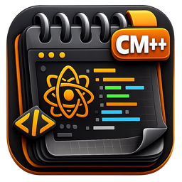

# CodeMac++ Downloads

<p align="center">
  
</p>

<h2 align="center">CodeMac++</h2>

<p align="center">
  A native macOS code editor built with Swift and AppKit.<br>
  By Antonio Scognamiglio
</p>

## Download

Download the latest version from the [Releases](https://github.com/dindonio/codemac-releases/releases) page.

### Requirements
- macOS 14+ (Sonoma)

### Installation
1. Download the `.dmg` file
2. Open the DMG
3. Drag CodeMac++ to your Applications folder
4. Launch from Applications

If macOS shows a security warning:
```bash
xattr -cr /Applications/CodeMac++.app
```

## Features

- 31 language syntax highlighting (including FortiOS)
- 6 color themes with orange accent
- AI integration (Claude, OpenAI, Gemini)
- Git & GitHub integration
- Side-by-side Compare/Diff
- Language Server Protocol (LSP) — auto-completion, hover, go-to-definition, diagnostics
- Integrated Terminal
- Command Palette, Quick Open
- And 75+ more features

For full documentation, visit the project page.

## Auto-Update

CodeMac++ checks for updates automatically once per day.
You can also check manually via Help → Check for Updates.

---

By Antonio Scognamiglio
